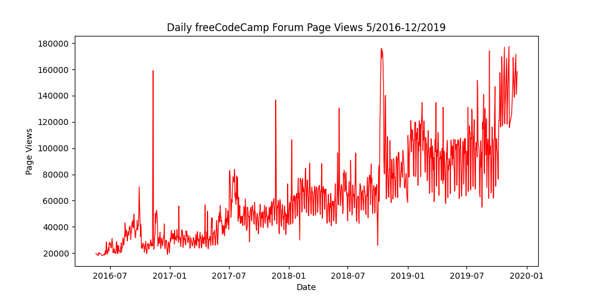
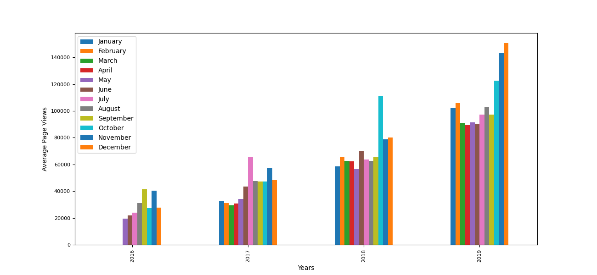
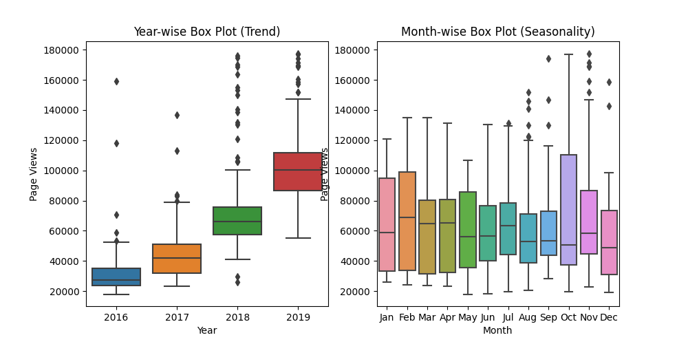

# Page-View-Time-Series-Visualizer-Python
This project involves visualizing time series data using various charts and libraries like Pandas, Matplotlib, and Seaborn. You will be working with a dataset containing the number of daily page views on the freeCodeCamp.org forum from May 9, 2016, to December 3, 2019. The visualizations will help you identify patterns, trends, and growth on a yearly and monthly basis.

## Getting Started

To start working on this project, follow these steps:

1. Import the project on [Replit](https://replit.com/).
2. In the Replit environment, you will see a `.replit` window. Select "Use run command" and click the "Done" button.

## Tasks

1. **Data Import and Cleaning**:
   - Use Pandas to import the data from "fcc-forum-pageviews.csv".
   - Set the index to the date column.
   - Clean the data by filtering out days when the page views were in the top 2.5% or bottom 2.5% of the dataset.

2. **Line Chart**:
   - Create a `draw_line_plot` function that uses Matplotlib to draw a line chart.
   - Title: Daily freeCodeCamp Forum Page Views 5/2016-12/2019
   - X-Axis Label: Date
   - Y-Axis Label: Page Views
   - The chart should resemble "examples/Figure_1.png".

3. **Bar Chart**:
   - Create a `draw_bar_plot` function that draws a bar chart.
   - Show average daily page views for each month grouped by year.
   - Legend: Month labels, Title: Months
   - X-Axis Label: Years, Y-Axis Label: Average Page Views
   - The chart should resemble "examples/Figure_2.png".

4. **Box Plots**:
   - Create a `draw_box_plot` function that uses Seaborn to draw two adjacent box plots.
   - The first box plot shows how values are distributed within a given year.
   - The second box plot shows how values are distributed within a given month and how it compares over time.
   - Title of the first chart: Year-wise Box Plot (Trend)
   - Title of the second chart: Month-wise Box Plot (Seasonality)
   - Ensure month labels on the bottom start at Jan, and the axes are labeled correctly.

## Getting Started

To run this project locally, follow these steps:

1. Clone this repository: `git clone https://github.com/yourusername/time-series-data-visualization.git`
2. Navigate to the project directory: `cd time-series-data-visualization`
3. Install the required libraries if not already installed: `pip install pandas matplotlib seaborn`
4. Run the Python script: `python main.py`
### Development

You can use `main.py` to test your functions. Click the "run" button in Replit, and `main.py` will run.

### Testing

Tests from `test_module.py` are imported to `main.py`. The tests will run automatically whenever you hit the "run" button.

## Screenshots

- Line Chart - Matplotlib:
  

- Bar Chart - Matplotlib:
  

- Box Plot - Seaborn :
  
## Data Source

The dataset is provided in the "fcc-forum-pageviews.csv" file.

## Project Structure

- `main.py`: Main script to execute data visualization functions.
- `test_module.py`: Unit tests are written for you under .
- `time_series_visualizer.py`: Given tasks are solved here with the help of pandas, matplotlib and seaborn.
- `fcc-forum-pageviews.csv`: Dataset containing time series data.
- `README.md`: Project documentation.

## Contributing

If you'd like to contribute to this project or report issues, please open a new issue or submit a pull request.

